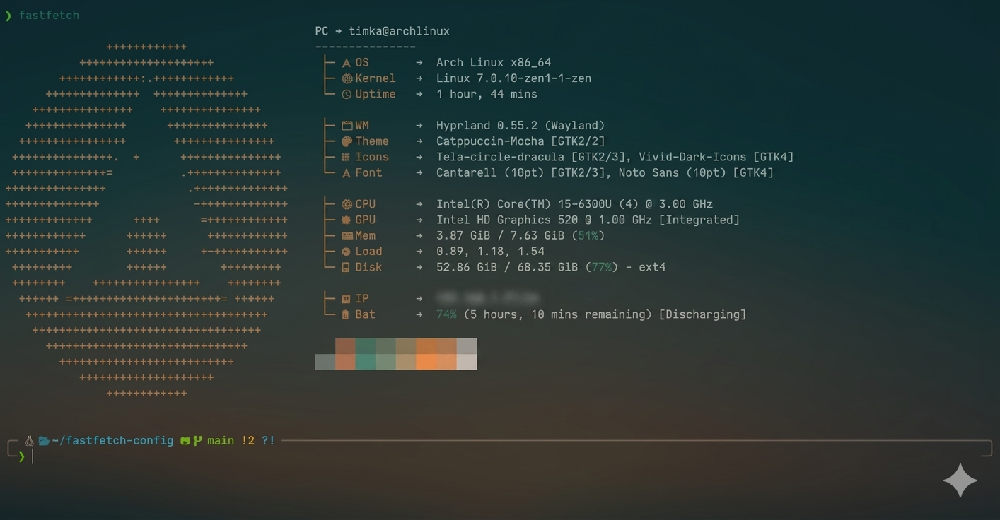

# Fastfetch Config

A minimal and clean fastfetch configuration with a hierarchical tree structure, designed for a modern look.

## Screenshot


## Installation

1. Ensure you have [fastfetch](https://github.com/fastfetch-cli/fastfetch) installed on your system.
2. Clone this repository or copy the configuration file manually:
   ```bash
   mkdir -p ~/.config/fastfetch
   cp config.jsonc ~/.config/fastfetch/config.jsonc

Note: To see the icons correctly, ensure you have a Nerd Font installed (e.g., JetBrainsMono Nerd Font).
